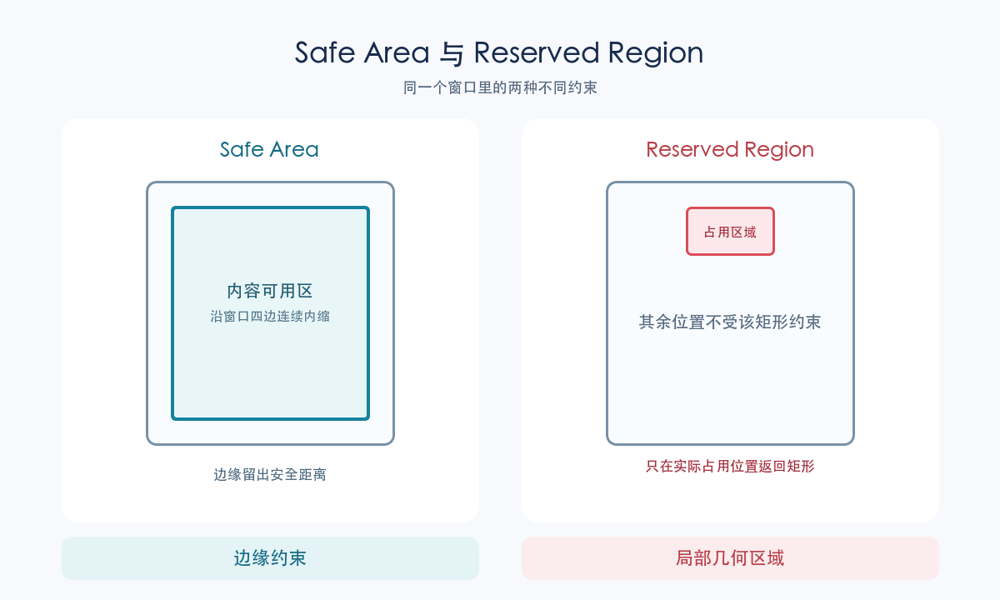
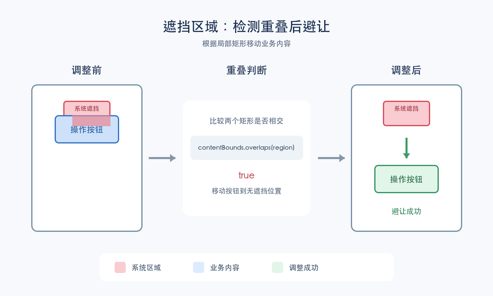
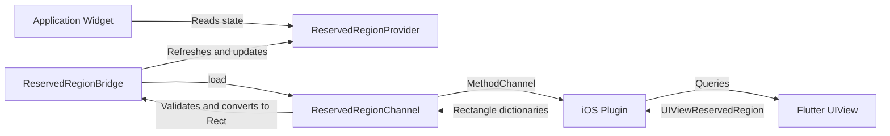

# Using iPhone Duo Reserved Regions in Flutter

English | [简体中文](<./iPhone Duo Reserved Region.zh-CN.md>)

## Overview

[tw_iphone_duo_reserved_region](https://pub.dev/packages/tw_iphone_duo_reserved_region)
converts active iOS occlusion regions into a list of `Rect` values in Flutter
window logical coordinates. When a custom interface needs to avoid a localized
obstruction such as a camera, it can read these rectangles and adjust its own
layout. This guide explains when the plugin is appropriate, how to integrate
it, how to handle its results, and how the implementation is verified.

## What is an iPhone Duo reserved region?

A reserved region is an area of a view's coordinate space occupied by a
physical part of the system. Two region kinds affect layout: a `division`
region splits the available space, such as the crease on iPhone Duo, while an
`occlusion` region covers a localized part of the content, such as an active
FaceTime camera. This plugin returns **only active `occlusion` regions**. It
does not return the `division` region for the crease, device posture, or hinge
state.

## Choosing between SafeArea and reserved regions



| | `SafeArea` | Reserved region |
| --- | --- | --- |
| Representation | Insets measured inward from the window edges. | A specific area in the view's coordinate space; this plugin reports active occlusion rectangles. |
| Best suited for | Standard screens, navigation bars, bottom actions, and other layouts that must avoid system content at the edges. | Custom edge UI, floating controls, and other content that must test for intersection with a localized obstruction. |
| Layout approach | Let system and Flutter components, including `SafeArea`, manage edge clearance. | Compare a component's bounds with each occlusion `Rect`, then move or rearrange it as needed. |

Prefer the system adaptation provided by standard components. Read reserved
regions only for custom edge UI or when precise avoidance is required. The
plugin provides geometry; it does not automatically change padding or widget
positions.

## Requirements

| Item | Requirement |
| --- | --- |
| Dart | `>=3.10.0 <4.0.0` |
| Flutter | 3.44 or later |
| iOS deployment target | 15.5 or later |
| Build environment | Xcode 27.1 or later with the iOS 27.1 SDK |
| Reserved-region runtime | A supported device running iOS 27.1 or later |

The minimum deployment target and API availability are separate requirements.
An application can deploy to iOS 15.5, but it must be compiled with an SDK
that declares the reserved-region API. On earlier runtimes, the native layer
returns `null` after an availability check.

## Recommended integration

Install the bridge near the application root so descendants can read the
latest result through the provider:

```dart
TwIphoneDuoReservedRegionBridge(
  child: MaterialApp(
    home: const HomePage(),
  ),
)
```

Read the value in a widget that needs to avoid occlusions:

```dart
final List<Rect>? regions =
    TwIphoneDuoReservedRegionProvider.activeOcclusionRegionsOf(context);
```

Query the channel directly only when the application already manages its own
refresh, caching, and state distribution:

```dart
final List<Rect>? regions =
    await const TwIphoneDuoReservedRegionChannel().load();
```

## Result and coordinate semantics

| Result | Meaning | Recommended handling |
| --- | --- | --- |
| `null` | The capability is unavailable, the initial query has not completed, or the query failed. | Use the normal fallback layout. Do not interpret this value as proof that no occlusion exists. |
| Empty list | The query succeeded and no `occlusion` region is currently active. | Keep the normal layout. |
| Non-empty list | The query succeeded and contains the currently active occlusion rectangles. | Test important content for intersection, then decide how it should move or rearrange. |

Each `Rect` uses Flutter window logical coordinates. If the target widget uses
a local coordinate system, convert its bounds to window coordinates after
layout and before calling `Rect.overlaps`. In this example, `targetContext`
belongs to the widget that must remain visible:

```dart
final renderObject = targetContext.findRenderObject();
if (renderObject is RenderBox && renderObject.hasSize) {
  final Rect targetInWindow = MatrixUtils.transformRect(
    renderObject.getTransformTo(null),
    Offset.zero & renderObject.size,
  );
  final bool isCovered = regions?.any(
        (Rect region) => region.overlaps(targetInWindow),
      ) ??
      false;
  // When isCovered is true, move or rearrange the widget as needed.
}
```



A `Rect` describes a localized obstruction and is not equivalent to
`EdgeInsets`. Adding uniform padding along an entire edge can waste space and
may still fail to avoid the obstruction precisely.

## Architecture



Each component owns one part of the data flow:

| Component | Source | Responsibility |
| --- | --- | --- |
| `TwIphoneDuoReservedRegionBridge` | [Bridge source](https://github.com/zeqinjie/tw_iphone_duo_reserved_region/blob/main/lib/src/tw_iphone_duo_reserved_region_bridge.dart) | Observes lifecycle and window changes, triggers queries, and stores the latest state. |
| `TwIphoneDuoReservedRegionProvider` | [Provider source](https://github.com/zeqinjie/tw_iphone_duo_reserved_region/blob/main/lib/src/tw_iphone_duo_reserved_region_provider.dart) | Exposes the result through an `InheritedWidget` and notifies descendants only when the list content changes. |
| `TwIphoneDuoReservedRegionChannel` | [Channel source](https://github.com/zeqinjie/tw_iphone_duo_reserved_region/blob/main/lib/src/tw_iphone_duo_reserved_region_channel.dart) | Calls the method channel, validates native data, and converts it into an immutable list of `Rect` values. |
| `TwIphoneDuoReservedRegionPlugin` | [iOS plugin source](https://github.com/zeqinjie/tw_iphone_duo_reserved_region/blob/main/ios/tw_iphone_duo_reserved_region/Sources/tw_iphone_duo_reserved_region/TwIphoneDuoReservedRegionPlugin.m) | Queries the current Flutter view on the main thread and serializes active occlusion rectangles. |

## Query data flow

The bridge calls the channel, which requests native data through a method
channel. The iOS implementation queries the Flutter view with
`[UIViewReservedRegionKind occlusionRegionKind]` and filters inactive regions
using `region.isActive`. It serializes each region as `left`, `top`, `width`,
and `height`. The Dart layer validates the array, numeric values, and
non-negative dimensions before converting each item to a `Rect`. Non-iOS
platforms return `null` without invoking the channel.

Method-channel contract:

```text
channel: tw591/iphone_duo_reserved_regions
method:  getActiveOcclusionRegions
result:  array of {left, top, width, height} | null
```

## Lifecycle refresh strategy

Reserved regions can change with window dimensions, device state, or the
application lifecycle. The bridge refreshes at these points:

- After the first frame, when the Flutter view and its geometry are ready.
- On `didChangeMetrics`, in response to window dimension and metrics changes.
- On `AppLifecycleState.resumed`, to synchronize state when the application
  returns to the foreground.

When refreshes overlap, the bridge accepts only the newest request's result so
stale window geometry cannot replace newer state.

## Error handling and safe fallback

When the channel encounters a `MissingPluginException`, `PlatformException`,
invalid array or rectangle data, or another unexpected exception, it calls
`FlutterError.reportError` and returns `null`. The application can therefore
remain on its fallback layout.

The native layer returns a `FlutterError` with the
`flutter_view_unavailable` code when the Flutter view is unavailable. Before
iOS 27.1 it returns `nil`, which becomes `null` on the Dart side.

## Swift Package Manager and CocoaPods

Both package managers use the same Objective-C source:

```text
ios/
├── tw_iphone_duo_reserved_region.podspec
└── tw_iphone_duo_reserved_region/
    ├── Package.swift
    └── Sources/
        └── tw_iphone_duo_reserved_region/
            ├── TwIphoneDuoReservedRegionPlugin.m
            └── include/
                └── tw_iphone_duo_reserved_region/
                    └── TwIphoneDuoReservedRegionPlugin.h
```

`Package.swift` defines the Swift package target and depends on Flutter's
generated `FlutterFramework`. The podspec points `source_files` and
`public_header_files` to the same `Sources` directory.

Native fixes therefore need to be made only once, and both integration methods
will use the same implementation.

## Verification strategy

The plugin is verified at four levels:

1. Dart unit tests cover data parsing, invalid-data fallback, and error
   reporting.
2. Widget tests cover first-frame, lifecycle, and metrics refreshes as well as
   stale-request rejection.
3. Package-manager builds compile the same native implementation with Swift
   Package Manager and CocoaPods.
4. Publication validation uses `dart pub publish --dry-run` to inspect archive
   contents and package metadata.

Common checks:

```console
flutter analyze
flutter test
dart pub publish --dry-run
```

## Further reading

- [Apple Tech Talk: Make your layout adaptive across every posture on iPhone Duo](https://developer.apple.com/videos/play/tech-talks/111463/): learn about `division`, `occlusion`, and the system layout guidance.
- [Apple UIKit `UIView` documentation](https://developer.apple.com/documentation/uikit/uiview): review view coordinates and reserved-region APIs.
