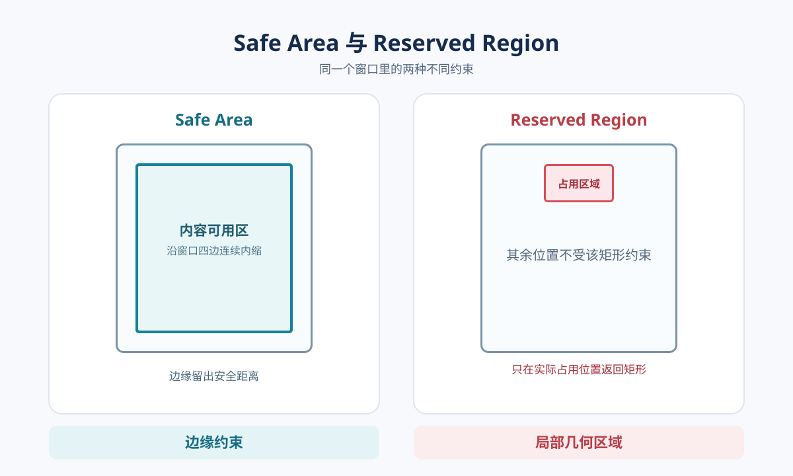
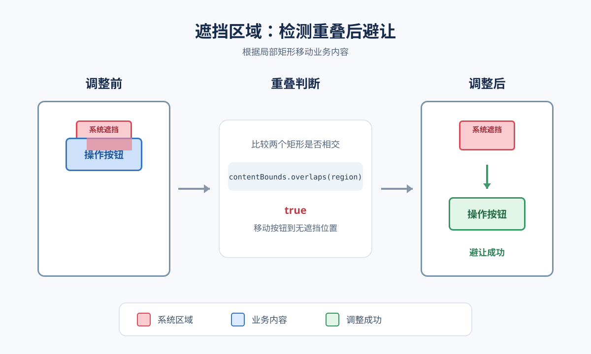
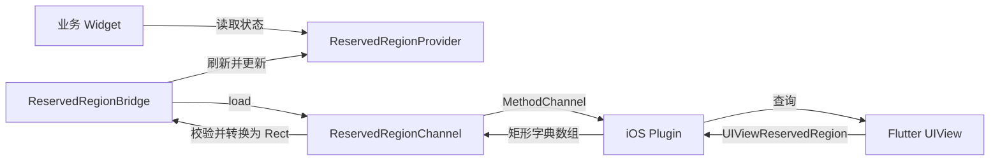

# iPhone Duo Reserved Region 插件使用指南

## 摘要

[tw_iphone_duo_reserved_region](https://pub.dev/packages/tw_iphone_duo_reserved_region) 将 iOS 当前激活的遮挡区域转换为 Flutter 窗口逻辑坐标中的 `Rect` 列表。需要为自定义界面避开摄像头等局部遮挡时，可以读取这些矩形并自行调整布局。本文先说明如何判断是否需要插件、如何接入及处理返回值，再介绍实现与验证方式。

## 什么是 iPhone Duo Reserved Region

Reserved Region 是视图坐标空间中被系统实体占用的区域。它有两种与布局相关的类型：`division` 将可用空间分割成多个区域，例如 iPhone Duo 的折痕；`occlusion` 只遮挡局部内容，例如启用中的 FaceTime 摄像头。本插件**只返回当前激活的 `occlusion` 区域**，不会返回折痕对应的 `division` 区域。本插件也不提供设备姿态或铰链状态信息。

## SafeArea 与 Reserved Region 怎么选



| | `SafeArea` | Reserved Region |
| --- | --- | --- |
| 表达形式 | 从窗口边缘向内留出安全空间。 | 位于视图坐标空间的具体区域；本插件提供激活的遮挡矩形。 |
| 适用场景 | 常规页面、导航栏、底部操作区等需要避开系统边缘内容的布局。 | 自定义边缘 UI、悬浮按钮等需要判断是否与局部遮挡相交的布局。 |
| 布局方式 | 由系统和 Flutter 的标准组件或 `SafeArea` 处理边缘留白。 | 将组件边界与遮挡 `Rect` 比较，再按业务需要移动或重排。 |

标准组件优先依赖系统适配；只有自定义边缘 UI 或需要精确避让时，才读取 Reserved Region。插件提供几何信息，不会自动修改 padding 或组件位置。

## 使用前提

| 项目 | 要求 |
| --- | --- |
| Dart | `>=3.10.0 <4.0.0` |
| Flutter | 3.44 或更高版本 |
| iOS Deployment Target | 15.5 或更高版本 |
| 编译环境 | Xcode 27.1 或更高版本，包含 iOS 27.1 SDK |
| Reserved Region 运行时 | iOS 27.1 或更高版本的受支持设备 |

最低部署版本与 API 可用版本是两个不同概念。应用可以部署到 iOS 15.5，但编译必须使用
声明了 Reserved Region API 的 SDK；在较早运行时上，原生层通过可用性检查返回 `null`。

## 推荐接入方式

在应用根部安装 Bridge，让后代组件通过 Provider 读取最新结果：

```dart
TwIphoneDuoReservedRegionBridge(
  child: MaterialApp(
    home: const HomePage(),
  ),
)
```

在需要避让的组件中读取：

```dart
final List<Rect>? regions =
    TwIphoneDuoReservedRegionProvider.activeOcclusionRegionsOf(context);
```

只有应用已自行管理刷新、缓存和状态分发时，才需要直接查询 Channel：

```dart
final List<Rect>? regions =
    await const TwIphoneDuoReservedRegionChannel().load();
```

## 返回值与坐标语义

| 返回值 | 含义 | 推荐处理 |
| --- | --- | --- |
| `null` | 能力不可用、尚未完成首次查询，或查询失败。 | 使用普通回退布局；不要据此断定当前没有遮挡。 |
| 空列表 | 查询成功，当前没有激活的 `occlusion` 区域。 | 保持普通布局。 |
| 非空列表 | 查询成功，包含当前激活的遮挡矩形。 | 对重要内容做相交判断，再决定如何避让。 |

返回的 `Rect` 使用 Flutter 窗口逻辑坐标。若目标组件位于局部坐标系，需要在布局完成后先把它的边界转换到窗口坐标，再调用 `Rect.overlaps`。下面的 `targetContext` 指向要保护的组件：

```dart
final renderObject = targetContext.findRenderObject();
if (renderObject is RenderBox && renderObject.hasSize) {
  final Rect targetInWindow = MatrixUtils.transformRect(
    renderObject.getTransformTo(null),
    Offset.zero & renderObject.size,
  );
  final bool isCovered = regions?.any(
        (Rect region) => region.overlaps(targetInWindow),
      ) ??
      false;
  // isCovered 时，按界面需要移动或重排目标组件。
}
```



`Rect` 描述的是局部遮挡，不等同于 `EdgeInsets`。给整条边统一增加 padding 可能浪费空间，也未必能准确避开遮挡。

## 整体架构



主要组件各负责一段数据流：

| 组件 | 文件 | 职责 |
| --- | --- | --- |
| `TwIphoneDuoReservedRegionBridge` | [Bridge 源码](https://github.com/zeqinjie/tw_iphone_duo_reserved_region/blob/main/lib/src/tw_iphone_duo_reserved_region_bridge.dart) | 监听生命周期和窗口变化，触发查询并保存最新状态。 |
| `TwIphoneDuoReservedRegionProvider` | [Provider 源码](https://github.com/zeqinjie/tw_iphone_duo_reserved_region/blob/main/lib/src/tw_iphone_duo_reserved_region_provider.dart) | 通过 `InheritedWidget` 向子树提供结果，只在列表内容变化时通知。 |
| `TwIphoneDuoReservedRegionChannel` | [Channel 源码](https://github.com/zeqinjie/tw_iphone_duo_reserved_region/blob/main/lib/src/tw_iphone_duo_reserved_region_channel.dart) | 调用 MethodChannel、校验原生数据并转换为不可修改的 `Rect` 列表。 |
| `TwIphoneDuoReservedRegionPlugin` | [iOS 插件源码](https://github.com/zeqinjie/tw_iphone_duo_reserved_region/blob/main/ios/tw_iphone_duo_reserved_region/Sources/tw_iphone_duo_reserved_region/TwIphoneDuoReservedRegionPlugin.m) | 在主线程查询当前 Flutter View，并序列化激活的遮挡矩形。 |

## 查询数据流

Bridge 调用 Channel，Channel 通过 MethodChannel 请求原生数据。iOS 实现使用 `[UIViewReservedRegionKind occlusionRegionKind]` 查询 Flutter View，并以 `region.isActive` 过滤未激活区域。每个区域序列化为 `left`、`top`、`width`、`height`；Dart 层校验数组、数字和非负尺寸后转换为 `Rect`。非 iOS 平台直接返回 `null`。

MethodChannel 协议：

```text
channel: tw591/iphone_duo_reserved_regions
method:  getActiveOcclusionRegions
result:  array of {left, top, width, height} | null
```

## 生命周期刷新策略

Reserved Region 可能随窗口尺寸、设备状态或应用生命周期变化。Bridge 在以下时机刷新：

- 首帧完成后：确保 Flutter View 已经建立并拥有有效几何信息。
- `didChangeMetrics`：响应窗口尺寸和 metrics 变化。
- `AppLifecycleState.resumed`：应用回到前台后重新同步系统状态。

若多次刷新并发，Bridge 只接受最新请求的结果，避免旧窗口几何信息覆盖新状态。

## 错误处理与安全回退

Channel 遇到 `MissingPluginException`、`PlatformException`、无效数组或矩形数据，以及其他未预期异常时，会调用 `FlutterError.reportError` 并返回 `null`。上层因此可以保持回退布局。

原生层在 Flutter View 不可用时返回带有 `flutter_view_unavailable` 错误码的
`FlutterError`；在 iOS 27.1 之前则返回 `nil`，对应 Dart 层的 `null`。

## Swift Package Manager 与 CocoaPods

两种包管理器指向同一套 Objective-C 源码：

```text
ios/
├── tw_iphone_duo_reserved_region.podspec
└── tw_iphone_duo_reserved_region/
    ├── Package.swift
    └── Sources/
        └── tw_iphone_duo_reserved_region/
            ├── TwIphoneDuoReservedRegionPlugin.m
            └── include/
                └── tw_iphone_duo_reserved_region/
                    └── TwIphoneDuoReservedRegionPlugin.h
```

`Package.swift` 定义 Swift Package target，并依赖 Flutter 生成的 `FlutterFramework`。
podspec 则将 `source_files` 和 `public_header_files` 指向相同的 `Sources` 目录。

修复原生逻辑时只需修改这一份源码，两种集成方式会使用相同实现。

## 验证策略

插件的验证重点分为四层：

1. Dart 单元测试：验证数据解析、无效数据回退和错误报告。
2. Widget 测试：验证 Bridge 的首帧刷新、生命周期刷新、metrics 刷新和过期请求丢弃。
3. 包管理器构建：分别通过 Swift Package Manager 与 CocoaPods 编译同一原生实现。
4. 发布校验：使用 `dart pub publish --dry-run` 检查归档内容和包元数据。

常用检查命令：

```console
flutter analyze
flutter test
dart pub publish --dry-run
```

## 延伸阅读

- [Apple Tech Talk：在 iPhone Duo 上使用自适应布局适配各种姿态](https://developer.apple.com/cn/videos/play/tech-talks/111463/)：了解 `division`、`occlusion` 和系统布局建议。
- [Apple UIKit `UIView` 文档](https://developer.apple.com/documentation/uikit/uiview)：查阅视图坐标与 Reserved Region 相关 API。
